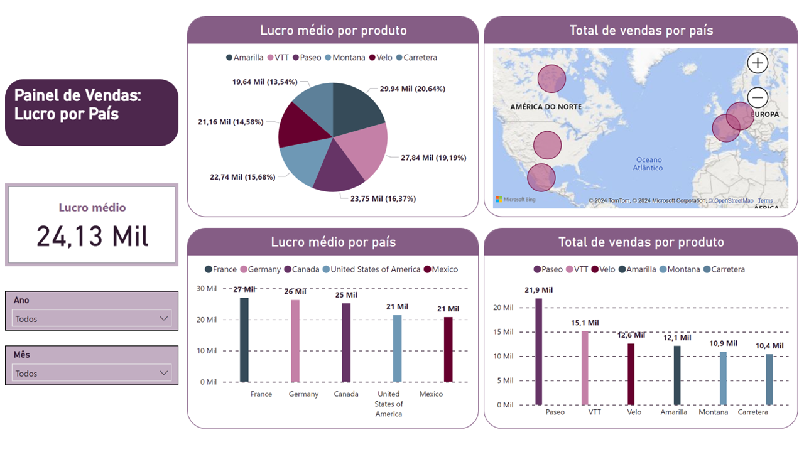

<h1>Modelando um Dashboard de E-commerce com Power BI Utilizando Fórmulas DAX</h1>

<h3>Repositório criado para o desafio do bootcamp NTT DATA - Engenharia de Dados com Python</h3>

<h4 align="justify">Descrição do projeto</h4>

    Este projeto consiste em um Painel de Vendas desenvolvido no Power BI, com o objetivo de analisar e visualizar dados de vendas e lucros por país e produto. Através do uso de medidas DAX personalizadas e de diversos tipos de visualizações, o dashboard oferece insights detalhados sobre o desempenho de vendas e produtos em diferentes regiões.

    O foco principal está na apresentação das métricas de <b>lucro médio</b> e <b>vendas totais</b>, filtradas por país e por produto, permitindo uma análise interativa e visual sobre a distribuição de lucros. Além disso, o painel permite a segmentação de dados por <b>ano</b> e <b>mês</b>, facilitando a análise temporal.

<h4 align="justify">Principais Métricas e Visualizações</h4>

    O painel inclui as seguintes métricas e visualizações:
    <ul>
        <li><b>Lucro Médio:</b> Calculado a partir do lucro total das vendas.
        <li><b>Total de Vendas por País:</b> Visualização em mapa que apresenta os volumes de vendas por país, destacando geograficamente as regiões de maior lucro.
        <li><b>Lucro Médio por Produto:</b> Gráfico de pizza que compara o lucro médio entre diferentes produtos.
        <li><b>Lucro Médio por País:</b> Gráfico de barras que exibe o lucro médio obtido em cada país.
        <li><b>Total de Vendas por Produto:</b> Gráfico de barras que mostra a performance de vendas para cada produto em diferentes regiões.
    </ul>

<h4 align="justify">Modelagem de Dados</h4>

   O projeto foi desenvolvido com uma modelagem de dados no formato de <b>Star Schema</b> (Esquema Estrela), organizando as tabelas da seguinte forma:
    <ul>
        <li><b>F_Vendas (Fato):</b> Contém dados de vendas como lucro, preço de venda, unidades vendidas, entre outros.
        <li><b>D_Calendário (Dimensão):</b> Tabela com informações sobre o tempo (ano, mês).
        <li><b>D_Produto (Dimensão):</b> Tabela com dados sobre os produtos vendidos.
        <li><b>D_Descontos (Dimensão):</b> Informações sobre faixas de desconto aplicadas.
    </ul>    
   
   Essa modelagem garante uma estrutura organizada e eficiente para consultas e cálculos complexos, melhorando a performance e a clareza nas análises.

<h4 align="justify">Funcionalidades Interativas</h4>

    <ul>
        <li><b>Filtros por Ano e Mês:</b> Permitem ao usuário refinar os dados de acordo com o período desejado.
        <li><b>Drill-down em Mapas:</b> Possibilita explorar vendas e lucros em diferentes níveis geográficos (países, regiões).
    </ul>

<h4 align="justify">Tecnologias Utilizadas</h4>

    <ul>
        <li><b>Power BI:</b> Plataforma de Business Intelligence utilizada para criação das visualizações e desenvolvimento das medidas DAX.
        <li><b>DAX (Data Analysis Expressions):</b> Utilizado para criar medidas personalizadas de análise, como o cálculo de lucro médio e total de vendas.
    </ul>    

<h4 align="justify">Como Executar</h4>

    <ol>
        <li>Clone este repositório.
        <li>Abra o arquivo <code>.pbix</code> no Power BI Desktop.
        <li>Explore o painel interativo e ajuste os filtros conforme necessário.
    </ol>    

<h4 align="justify">Visualizações</h4>

